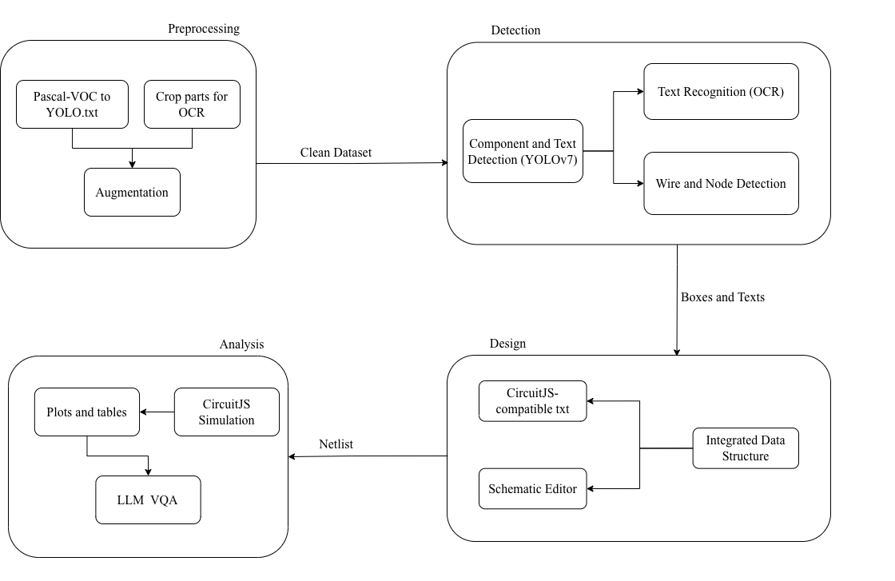
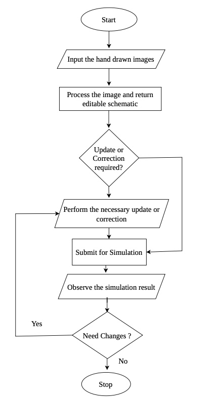
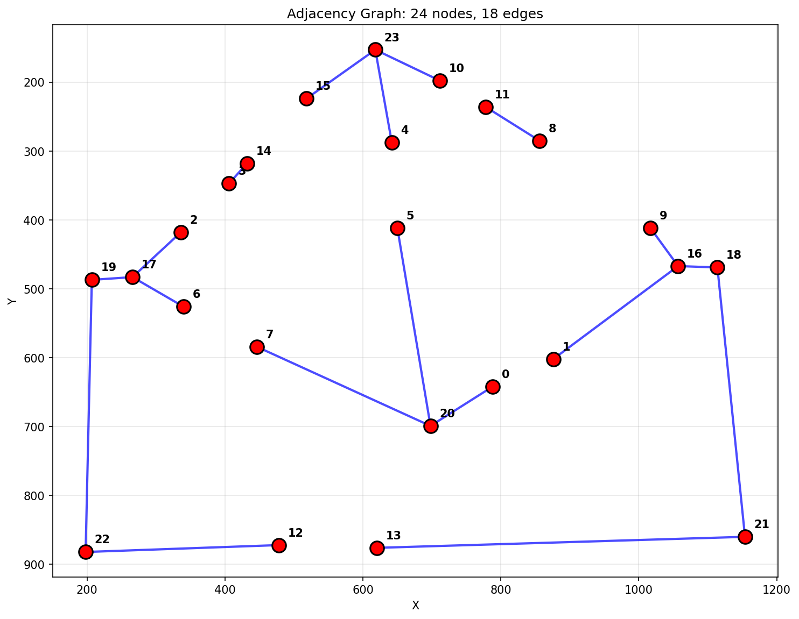
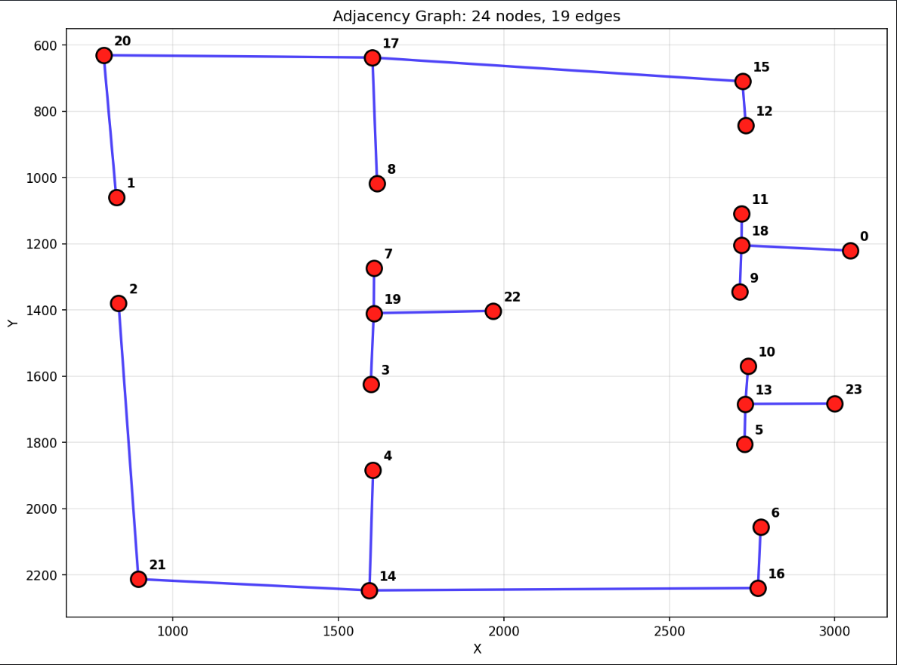
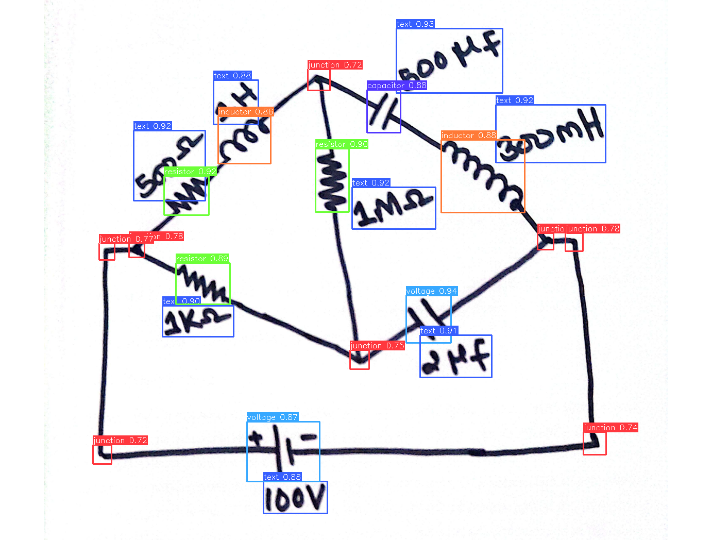
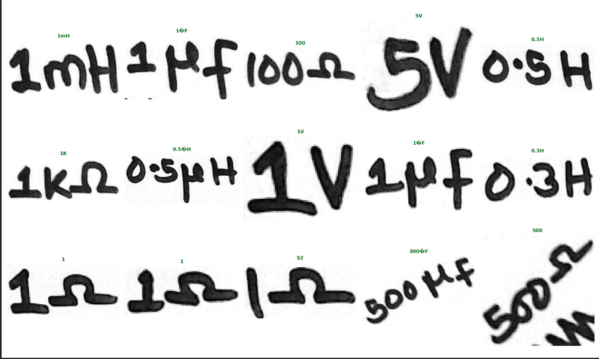
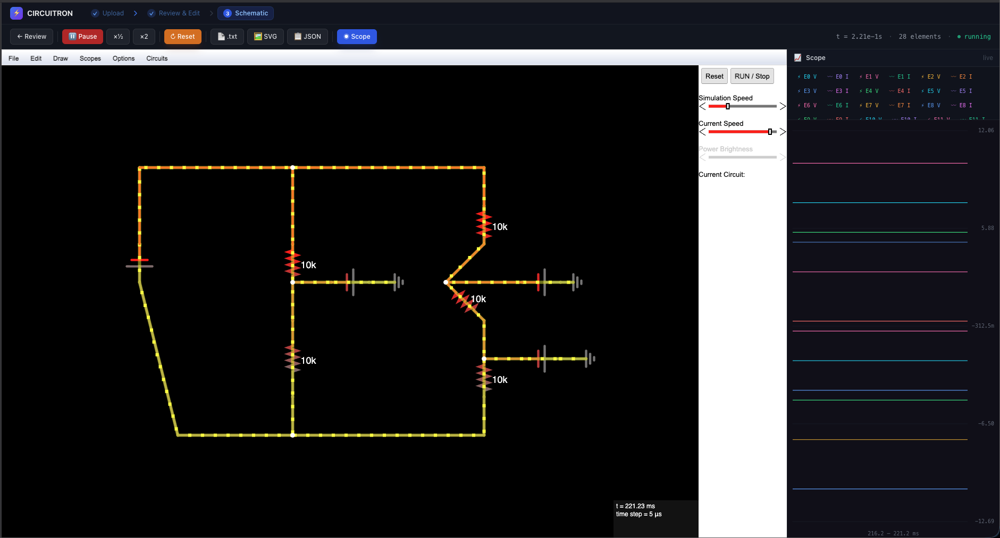
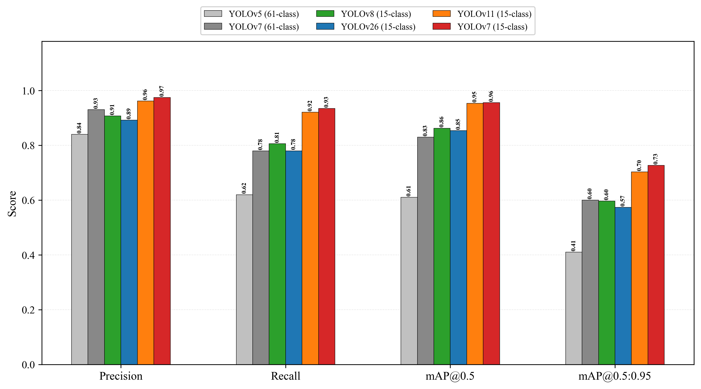

# CIRCUITRON

**Hand-Drawn Circuit Diagrams → Interactive Digital Schematics with Live Simulation**

CIRCUITRON is an end-to-end ML-powered application that converts photographs or scans of hand-drawn electrical circuit diagrams into fully editable, simulatable digital schematics. The user uploads an image, reviews and corrects the ML detections, and receives a live SPICE-level simulation via [CircuitJS1](https://www.falstad.com/circuit/) — all in the browser. An embedded AI assistant (DeepSeek-V3.1) helps users understand, debug, and improve their circuits in real time.

---

## Table of Contents

- [System Overview](#system-overview)
- [Block Diagram](#block-diagram)
- [System Flowchart](#system-flowchart)
- [ML Pipeline](#ml-pipeline)
  - [Stage 1 — YOLO Component Detection](#stage-1--yolo-component-detection)
  - [Stage 2 — OCR Text Recognition](#stage-2--ocr-text-recognition)
  - [Stage 3 — Proximity Mapping](#stage-3--proximity-mapping)
  - [Stage 4 — Line Detection & Adjacency Graph](#stage-4--line-detection--adjacency-graph)
- [Circuit Simulation](#circuit-simulation)
- [YOLO Model Comparison](#yolo-model-comparison)
- [Repository Structure](#repository-structure)
- [Setup](#setup)
- [Tech Stack](#tech-stack)
- [Previous Repositories](#previous-repositories)

---

## System Overview

CIRCUITRON processes a hand-drawn circuit image through a four-stage ML pipeline:

```
📷 Image Upload → 🔍 YOLO Detection → 📝 OCR Reading → 🔗 Proximity Mapping → 🧵 Line Detection → ⚡ CircuitJS1 Simulation
```

**Key Features:**

- **15-class YOLOv7 detection** — resistors, capacitors, diodes, voltage sources, transistors, op-amps, ICs, inductors, switches, junctions, terminals, ground, Vss, crossovers, and text labels
- **Dual OCR modes** — ⚡ Fast (custom CRNN) and 🔬 Accurate (fine-tuned TrOCR)
- **Skeleton-based wire tracing** — morphological skeletonization + multi-head BFS for full connectivity graph
- **Real-time threshold preview** — client-side canvas rendering for binary threshold tuning before analysis
- **Interactive review & edit** — six diagnostic views with toggle-able SVG overlays and editable component lists
- **Live CircuitJS1 simulation** — embedded simulator with run/pause, timestep control, SVG/TXT/JSON export
- **AI Circuit Assistant** — floating chat powered by Lightning AI / DeepSeek-V3.1

---

## Block Diagram

<p align="center">
  
</p>
<p align="center"><em>High-level system block diagram showing the end-to-end pipeline from image upload to circuit simulation.</em></p>

```
┌──────────────────────────────────────────────────────────────┐
│                     Frontend  (Next.js)                      │
│                                                              │
│   Upload ──► Review / Edit ──► Simulate (CircuitJS1 iframe)  │
│                                    └── AI Chat (floating)    │
│   Real-time threshold preview (client-side Canvas)           │
│   OCR mode toggle: ⚡ Fast (CRNN) │ 🔬 Accurate (TrOCR)     │
└────────────────────────┬─────────────────────────────────────┘
                         │  REST API (FastAPI)
                         ▼
┌──────────────────────────────────────────────────────────────┐
│                     Backend  (FastAPI)                        │
│                                                              │
│   unified_pipeline.py (orchestrator)                         │
│     ├── yolo_detector.py    (Stage 1: YOLO detection)        │
│     ├── custom_ocr.py       (Stage 2a: CRNN Fast OCR)        │
│     ├── ocr_service.py      (Stage 2b: TrOCR Accurate OCR)   │
│     ├── proximity_mapper.py (Stage 3: text-component match)  │
│     ├── pipeline.py         (Stage 4: skeleton + BFS graph)  │
│     └── circuit_to_cjs()    (CJS netlist export)             │
│   chat_service.py ─── Lightning AI / DeepSeek-V3.1           │
└────────────────────────┬─────────────────────────────────────┘
                         │
┌──────────────────────────────────────────────────────────────┐
│                     Model Weights                            │
│   yolov7new/best.pt         (YOLOv7, 15-class)              │
│   customOCR/crnn_last.pth   (CRNN, fast mode)                │
│   OCRmodel/trocrfinetuned/  (TrOCR-small, fine-tuned)        │
└──────────────────────────────────────────────────────────────┘
```

---

## System Flowchart

<p align="center">
  
</p>
<p align="center"><em>Detailed flowchart of the ML pipeline from raw image input through each processing stage to CircuitJS1 simulation output.</em></p>

---

## ML Pipeline

### Stage 1 — YOLO Component Detection

Custom-trained **YOLOv7** model detects 15 classes of circuit elements in hand-drawn images.

| Index | Class                   | Index | Class        |
| ----- | ----------------------- | ----- | ------------ |
| 0     | `capacitor`             | 8     | `resistor`   |
| 1     | `crossover`             | 9     | `switch`     |
| 2     | `diode`                 | 10    | `terminal`   |
| 3     | `gnd`                   | 11    | `text`       |
| 4     | `inductor`              | 12    | `transistor` |
| 5     | `integrated_circuit`    | 13    | `voltage`    |
| 6     | `junction`              | 14    | `vss`        |
| 7     | `operational_amplifier` |       |              |

**Inference settings:** `imgsz=640`, `conf=0.25`, `iou=0.45`

### Stage 2 — OCR Text Recognition

Users choose between two OCR backends:

|                  | ⚡ Fast Mode (CRNN)                 | 🔬 Accurate Mode (TrOCR)    |
| ---------------- | ----------------------------------- | --------------------------- |
| **Architecture** | VGG (6 conv) → BiLSTM → CTC         | ViT encoder + GPT-2 decoder |
| **Input**        | Grayscale, height 32px              | RGB, 384×384                |
| **Speed**        | ~5–10× faster                       | Higher accuracy             |
| **Characters**   | 90 chars (digits, letters, Ω, µ, ×) | Full vocabulary             |

### Stage 3 — Proximity Mapping

Greedy one-to-one matching of OCR text regions to nearest components using **edge-to-edge distance** (max 250 px). Each component receives `value`, `value_confidence`, and `matched_text_bbox` fields.

### Stage 4 — Line Detection & Adjacency Graph

Skeleton-based wire connectivity extraction:

1. **Preprocessing** — median blur → binary threshold (adjustable) → invert → erase text regions
2. **Skeletonization** — morphological dilation → `skimage.morphology.skeletonize`
3. **Endpoint detection** — skeleton intersections at bounding-box borders
4. **Endpoint merging** — cluster endpoints within 5 px
5. **Multi-head BFS** — walk skeleton from each node, discover connections, prune internal edges
6. **Output** — node positions, adjacency edges, and diagnostic images

#### Results: Wheatstone Bridge — Line Detection & Adjacency Graph

<p align="center">
  
</p>
<p align="center"><em>Wheatstone bridge circuit with correctly detected lines and wire connections. The adjacency graph shows accurate connectivity between all components including the bridge topology.</em></p>

#### Results: Voltage Divider — Line Detection & Adjacency Graph

<p align="center">
  
</p>
<p align="center"><em>Voltage divider circuit with detected wire connections. Lines are correctly traced between the series resistors and voltage source.</em></p>

#### Results: YOLOv7 Detection on Hand-Drawn Circuit

<p align="center">
  
</p>
<p align="center"><em>Retrained YOLOv7 detection result on a hand-drawn circuit. Color-coded bounding boxes show detected components — resistors (green), inductors (orange), capacitors (purple), voltage sources (blue), junctions (red), and text labels (blue) — each with class name and confidence score.</em></p>

---

## OCR Results

The OCR engine reads handwritten component values (e.g., 1KΩ, 5V, 1µF, 0.5H) from cropped text regions detected by YOLO. Below are sample OCR predictions (green text above each handwritten label):

<p align="center">
  
</p>
<p align="center"><em>OCR recognition results on handwritten component values. Green annotations show the model's predicted text for each cropped label — correctly reading values like 1mH, 1µF, 100Ω, 5V, 0.5H, 1KΩ, 0.5µH, 1V, 1µF, 0.3H, 300µF, and 500Ω from hand-drawn text.</em></p>

---

## Circuit Simulation

The final pipeline output is converted to a CircuitJS1 netlist and loaded into an embedded simulator iframe. The backend handles coordinate rescaling (to a compact ~500 px range), grid snapping (48 px grid), and component-code mapping.

#### Results: Voltage Divider — Simulated Circuit

<p align="center">
  
</p>
<p align="center"><em>Simulated voltage divider circuit rendered in the CIRCUITRON frontend via CircuitJS1. The hand-drawn diagram has been fully converted into an interactive, simulatable digital schematic with correct component values and connectivity.</em></p>

---

## Backend

- **Overview:** FastAPI-based service that orchestrates the full pipeline (detection → OCR → proximity mapping → line detection → netlist export) and exposes a small REST API for the frontend and programmatic access.
- **Key files:** [code/backend/main.py](code/backend/main.py) : FastAPI app; [code/backend/unified_pipeline.py](code/backend/unified_pipeline.py) : pipeline orchestrator; [code/backend/yolo_detector.py](code/backend/yolo_detector.py); [code/backend/ocr_service.py](code/backend/ocr_service.py); [code/backend/pipeline.py](code/backend/pipeline.py); [code/backend/proximity_mapper.py](code/backend/proximity_mapper.py).
- **Typical API (examples):** image upload (POST `/api/upload`), job status (GET `/api/status/{id}`), annotations/netlist download (GET `/api/netlist/{id}`), annotated preview (GET `/api/annotated/{id}`). Consult `main.py` for the exact routes.
- **Run locally:**

```bash
cd code/backend/
pip install -r requirements.txt
bash start.sh  # or `uvicorn main:app --host 0.0.0.0 --port 8000` for manual start
```

- **Environment & scaling:** configure `MODEL_PATHS`, `STORAGE_DIR`, `WORKERS`, and GPU device selection via environment variables; run multiple Uvicorn workers behind a reverse proxy (NGINX) or container orchestration for scale. Use the `--no-cache` / job-queue pattern for safe concurrent inference when GPU memory is limited.
- **Deployment:** packaged in `deployment/` with a Dockerfile and configs for Railway / Render; the backend can be containerized (see `deployment/Dockerfile`).
- **Logging & monitoring:** standard Python logging is used; route-level metrics and job status are easy to wire into Prometheus/Grafana or external error trackers.

## Frontend

- **Overview:** Next.js + TypeScript application providing the user UI for image upload, review/edit overlays, threshold tuning, and an embedded CircuitJS1 simulator. The UI also hosts the floating AI assistant for guided help and suggestions.
- **Key files:** [code/frontend/package.json](code/frontend/package.json); [code/frontend/app/layout.tsx](code/frontend/app/layout.tsx) (app shell and global styles); UI components live under `code/frontend/app/` and `code/frontend/components/`.
- **Integration:** frontend calls the backend REST API for uploads and results; circuit simulation is loaded into an iframe (CircuitJS1). Configurable client env vars include `NEXT_PUBLIC_API_URL` and `NEXT_PUBLIC_CJS_IFRAME_SRC`.
- **Run locally:**

```bash
cd code/frontend/
npm install
npm run dev
```

- **Build & deploy:** build with `npm run build` and deploy to Vercel, Netlify, or serve the static build from a Node server / CDN. For full-stack deploys, pair the frontend with the backend container and configure CORS and env vars accordingly.
- **UX features:** real-time threshold preview on canvas, toggle between OCR modes, six diagnostic SVG overlay views, editable component lists, and direct export (SVG/TXT/JSON) of annotated results.

## YOLO Model Comparison

Multiple YOLO model architectures were evaluated for circuit component detection:

<p align="center">
  
</p>
<p align="center"><em>Bar graph comparison of all YOLO model variants evaluated for circuit component detection. The comparison covers metrics including mAP, precision, recall, and F1-score across different model sizes and training configurations.</em></p>

---

## Repository Structure

```
Circuitron/
├── code/
│   ├── backend/            # Python pipeline: YOLO, OCR, line detection, proximity mapping
│   ├── frontend/           # Next.js frontend (deployment version)
│   └── webapp/             # Full web application
│       ├── backend/        # FastAPI backend with ngspice simulation
│       └── frontend/       # Next.js frontend with circuit editor & simulation
├── notebooks/
│   ├── line-detection/     # Line detection algorithm experiments & iterations
│   ├── pipeline/           # Full pipeline notebooks
│   └── experiments/        # YOLO checks, EasyOCR experiments
├── report/                 # LaTeX final year project report
├── docs/
│   ├── readmes/            # Component-specific documentation
│   └── papers/             # Reference papers
├── Figtoaddinreadme/       # Figures used in this README
├── test-images/            # Circuit diagram test images
├── deployment/             # Docker, Railway, Render deployment configs
└── legacy/                 # Notes on archived old repos
```

---

## Setup

### Backend

```bash
cd code/backend/
pip install -r requirements.txt
bash start.sh
```

### Frontend

```bash
cd code/frontend/
npm install
npm run dev
```

### Full Web Application

```bash
cd code/webapp/backend/
pip install -r requirements.txt
cd ../frontend/
npm install
npm run dev
```

---

## Tech Stack

| Layer              | Technology                                         |
| ------------------ | -------------------------------------------------- |
| **Frontend**       | Next.js, React, TypeScript, Tailwind CSS           |
| **Backend**        | FastAPI, Python, Uvicorn                           |
| **Detection**      | YOLOv7 (Ultralytics), custom-trained on 15 classes |
| **OCR**            | TrOCR (HuggingFace), Custom CRNN (PyTorch)         |
| **Line Detection** | OpenCV, scikit-image, BFS pathfinding              |
| **Simulation**     | CircuitJS1 (embedded), ngspice                     |
| **AI Assistant**   | Lightning AI / DeepSeek-V3.1                       |
| **Deployment**     | Docker, Railway, Render                            |

---

## Previous Repositories

This is a unified repository consolidating:

- `HostingCircuitron` — Latest deployed code (primary source)
- `CircuitronFinalYearProject` — Complete materials collection
- `CircuitronWebApp` — Full web application
- `LineDetection` — Line detection experiments
- `CustomPathFinding` — Advanced line detection with BFS/pathfinding
- `FinalCodeofCircuitron` — Earlier code version
- `CktnFromstart` — Earlier code version
- `Circuitron-Latex-Reportmyversionb` — LaTeX report
- `Circuitron` — Original repo
